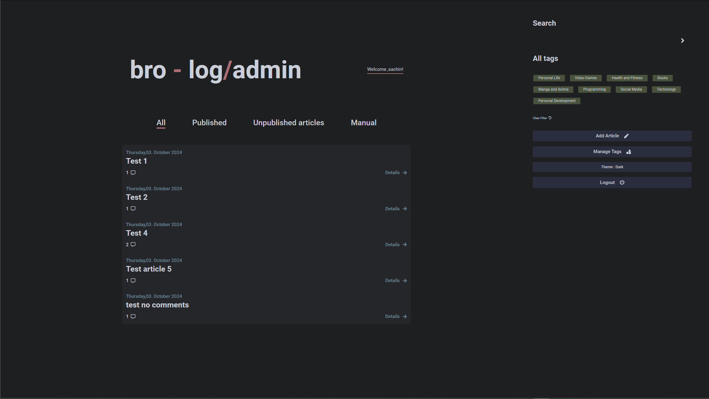
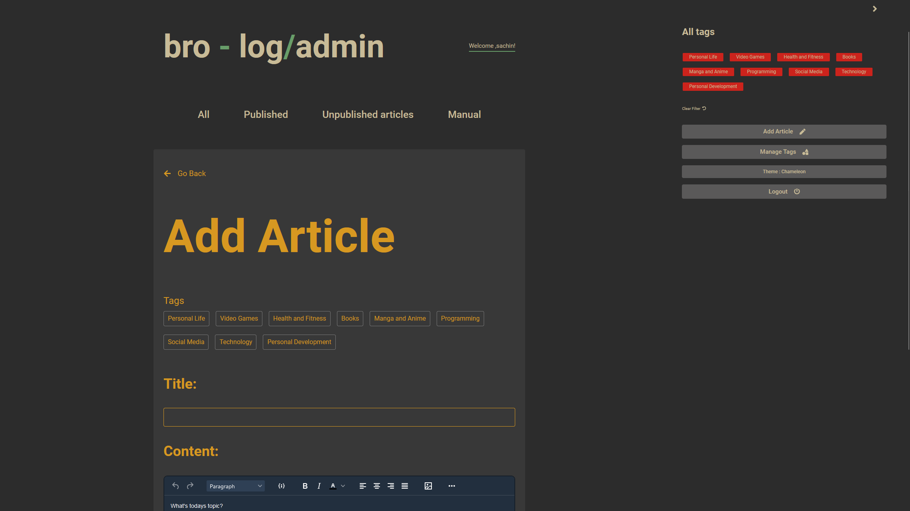
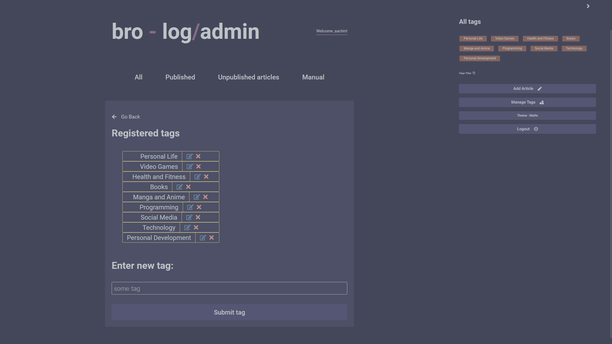
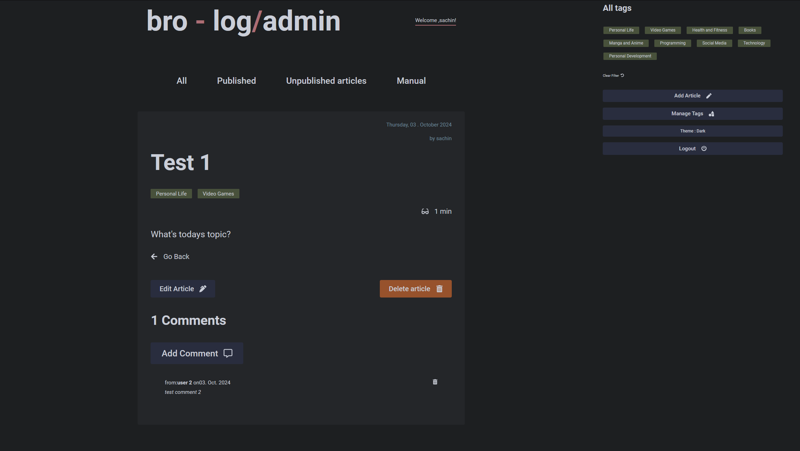

# Code-Blog-Admin

Frontend-Admin is a tool designed to manage the content of your blog. With a user-friendly interface, you can easily create, edit, and delete articles, manage tags, and moderate comments, of your blog. The tool is built with React and TypeScript and is powered by a self-coded RESTful blog API written in Express.

## Features

- Creating, editing and deleting articles
- Adding and managing tags
- WYSIWYG editor for content creation
- Moderating article comments
- Five different color themes to choose from

## API

The CMS fetches data from a self-coded RESTful blog API. The source code for the API can be found at [https://github.com/jet-black-ninja/brolog-api](https://github.com/jet-black-ninja/brolog-api).

## Client

The source code for the blog-client frontend can be found at [https://github.com/jet-black-ninja/bro-log-client](https://github.com/jet-black-ninja/bro-log-client).

## Installation

1.  Clone the repository to your local machine: `git clone https://github.com/erynder-z/code-blog-admin.git`
2.  Navigate to the project directory: `cd frontend-admin-main`
3.  Install the required dependencies: `npm install`
4.  Start the development server: `npm run dev`

## How to use

1. Create a new author by making a POST request to the API endpoint `/api/signup` with the following data-payload: `username:<your_username>`, `password:<your_passowrd>`, `confirmPassword:<repeat_password>`, `signup_secret:<secret_key_as_defined_by_the_API>`.
2. Login with the created user credentials.
3. Check out the "Manual" section for detailed instructions on how to use the CMS.

## Acknowledgments

- [@tinymce/tinymce-react](https://github.com/tinymce/tinymce-react) - A React wrapper for the TinyMCE editor.
- [Date-fns](https://date-fns.org/) - A library for manipulating dates in JavaScript.
- [Html-entities](https://github.com/mdevils/node-html-entities) - A library for encoding and decoding HTML entities.
- [Html-react-parser](https://github.com/remarkablemark/html-react-parser) - A library for converting HTML strings into React components.
- [Prismjs](https://prismjs.com/) - A library for syntax highlighting in the browser.
- [React](https://reactjs.org/) - A JavaScript library for building user interfaces.
- [React-icons](https://github.com/react-icons/react-icons) - A library for adding icons to React projects.
- [React-loader-spinner](https://github.com/mhnpd/react-loader-spinner) - A library for adding a loading spinner to React projects.
- [React-router-dom](https://github.com/ReactTraining/react-router/tree/master/packages/react-router-dom) - A library for routing in React projects.
- [String-strip-html](https://github.com/vkurchatkin/string-strip-html) - A library for stripping HTML tags from strings.
- [TypeScript](https://www.typescriptlang.org/) - A typed superset of JavaScript that compiles to plain JavaScript.
- [EsLint](https://eslint.org/) - A linter for JavaScript and TypeScript code.
- [Prettier](https://prettier.io/) - An opinionated code formatter for JavaScript and TypeScript code.
- [Vite](https://vite.dev/) - A fast build tool for JavaScript and TypeScript projects.

## Screenshots

